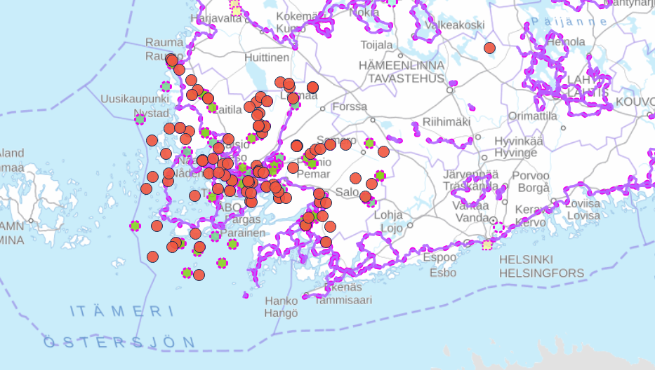

# Digiretki — Data Transfer Solution

A reusable geodata point and route information transfer pipeline for submitting new places to the [lipas.fi](https://lipas.fi/) national database (with deduplication) for further inclusion in the [luontoon.fi](https://luontoon.fi/) national outdoor recreation portal.

We have used this solution to transfer the dataset of [Virma](https://virma.fi/) to [Lipas](https://lipas.fi/) semi-automatically. Hopefully it can be of use for your organization. The target audience of this repository are GIS-developers and it is not usable without knowledge about Python programming, GIS geodata and Jupyter Notebooks. 

**More on the [Digiretki](https://tt.utu.fi/sweng/digiretki/) project [here](https://tt.utu.fi/sweng/digiretki/).**




## Suomeksi: Digiretki - Tiedonsiirtoratkaisu
Paikkatietojen siirtoratkaisu tiedon lähettämiseksi [lipas.fi](https://lipas.fi/) kansalliseen tietokantaan (*kopioiden/duplikaattien tunnistuksella*).

Olemme käyttäneet tätä ratkaisua Virman-tietoaineiston puoliautomaattiseen siirtämiseen Lipakseen. Toivottavasti ratkaisusta on hyötyä organisaatiollenne.

Tämän ohjelmistoprojektin/repon kohderyhmänä ovat paikkatietokehittäjät, eikä sitä voi käyttää ilman Python-ohjelmoinnin, paikkatietoaineistojen ja Jupyter Notebookien tuntemusta.

**Lisätietoja [Digiretki](https://tt.utu.fi/sweng/digiretki-fi/) -projektista [täällä](https://tt.utu.fi/sweng/digiretki-fi/).**

## Documentation

- [Lipas synchronization solution](Documentation/lipas_synchronization_solution.md)
- [Deduplication](Documentation/point_deduplication.md)
- [Deduplication pipeline](notebooks/point_deduplicator/README.md)
- [Type mapping (Virma–LIPAS example)](Documentation/virma_lipas_type_mapping/README.md)

## Notebooks

- [`point_deduplicator.ipynb`](notebooks/point_deduplicator/point_deduplicator.ipynb) — match point objects across datasets
- [`route_deduplicator.ipynb`](notebooks/route_deduplication/route_deduplicator.ipynb) — deduplicate route data

Launch with [uv](https://docs.astral.sh/uv/):

```bash
uv run jupyter lab
```

## Related
 - https://github.com/Lounaispaikka/virma_backend#point-example-from-virmafi (source system)
 - https://github.com/lipas-liikuntapaikat/lipas (target system)
 - https://github.com/Lounaispaikka/virma_lipas (other direction continuous importing from lipas to you)
 - https://github.com/koivunen/visitfinland-scrape
 - https://virma.fi/
 - https://virma.lounaistieto.fi/
 - https://www.luontoon.fi/en/about-the-service
 
## License

MIT — see [LICENSE](LICENSE.md).

## Acknowledgements

Code artifacts produced as part of the [Digiretki](https://tt.utu.fi/sweng/digiretki/) project. Co-funded by the European Union.

*We thank the Lipas staff for their invaluable help in forming this solution. We also thank Metsähallitus for their guidance and support in progressing the project and this solution to the right direction!*


